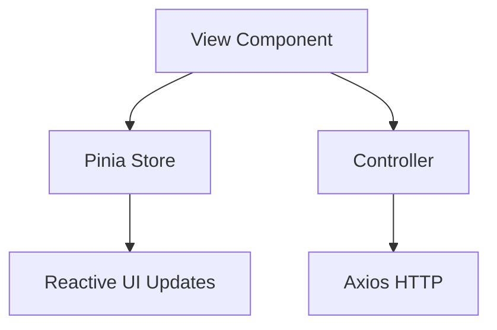

# Architecture & Technology Stack

## 1. Core Technology Stack

This application is built on a modern, high-performance frontend stack:

-   **Framework**: [Vue 3](https://vuejs.org/) (Composition API with `<script setup>`)
-   **Build Tool**: [Vite](https://vitejs.dev/)
-   **State Management**: [Pinia](https://pinia.vuejs.org/) (Global Stores)
-   **Routing**: [Vue Router 4](https://router.vuejs.org/)
-   **Language**: JavaScript (ESModules)
-   **HTTP Client**: [Axios](https://axios-http.com/)

## 2. Architectural Patterns

We strictly separate **UI (Views/Components)** from **Business Logic (Controllers/Stores)**.

### The separation of concerns Layers

1.  **Views (`src/views`)**: Page-level components (Screens). Responsible for layout and connecting data to components.
2.  **Components (`src/components`)**: Reusable UI elements.
    -   `ui/`: Base design system components (buttons, inputs). strictly presentational.
    -   `routes/`, `planned_routes/`: Domain-specific components.
3.  **Controllers (`src/controllers`)**: **Business Logic Layer**.
    -   Encapsulates API calls.
    -   Handles data transformation.
    -   *Example*: `src/controllers/auth` handles login logic, token parsing, etc.
4.  **Stores (`src/stores`)**: **Global State**.
    -   `auth.js`: User session, permissions, tokens.
    -   `ui.js`: Global UI state (loading spinners, toast notifications, sidebar state).

### Flow Type

## 3. Security Architecture

High security is a non-negotiable requirement.

### Authentication (JWT)
-   **Access Tokens**: Short-lived, stored in memory (via closures/variables) or HttpOnly cookies (preferred).
-   **Refresh Tokens**: Handled automatically via `src/utils/axios-interceptors.js`.
-   **Token Manager**: `src/utils/token-manager.js` monitors expiration and preemptively refreshes or logs out.

### CSRF Protection
-   **CSRF Manager**: `src/utils/csrf-manager.js` fetches valid CSRF tokens from the backend.
-   Axios interceptors attach `X-CSRF-TOKEN` headers to all mutating requests.

## 4. Testing Strategy

We follow the **Testing Pyramid**:

1.  **E2E Tests (Playwright)**: `tests/e2e`. Critical user flows (Login, Create Route). "Smoke Tests" run on every commit.
2.  **Unit/Component Tests (Vitest)**: `src/components/**/__tests__`. logic validation.

## 5. Key Directories

| Directory | Purpose |
|-----------|---------|
| `src/assets` | Static assets and global CSS (`design-system.css`). |
| `src/components/ui` | **Design System** primitives. Use these! |
| `src/composables` | Reusable Vue logic (hooks). |
| `src/controllers` | API bridge and business logic. |
| `src/core` | Core plugins (i18n, etc). |
| `src/router` | Application routes and navigation guards. |
| `src/stores` | Pinia Global State definitions. |
| `src/utils` | Helper functions and security managers. |

## 6. Further Reading

-   **[Switching to Legacy APIs](./developer/API_SWITCHING.md)**: Guide for reverting to older API patterns.
-   **[Deprecation Policy](./developer/DEPRECATION.md)**: Details on soft/hard deprecated components.
-   **[PDF Generation System](./07_PDF_SYSTEM_ARCHITECTURE.md)**: Detailed architecture and flow of the reporting engine.
